# Chatwork 送信くん — データベース設計

本ページでは、Chatwork 送信くん（FastAPI + Next.js）の **公式 DB 設計** をまとめています。

## 🎯 目的

- Chatwork のルームへ **一斉送信** できる仕組みを作る
- 送信先を **グループ化して管理** できる
- 過去の送信内容を **ログとして保持** する

---

# 🗄️ データベース構成（PostgreSQL）

## 1. users（アプリユーザー）

| カラム名      | 型                      | 説明                 |
| ------------- | ----------------------- | -------------------- |
| user_id       | SERIAL PK               | ユーザー ID          |
| email         | VARCHAR(255) UNIQUE     | メールアドレス       |
| password_hash | TEXT                    | パスワードのハッシュ |
| user_name     | VARCHAR(255)            | 表示名               |
| created_at    | TIMESTAMP DEFAULT now() | 作成日時             |
| updated_at    | TIMESTAMP DEFAULT now() | 更新日時             |

---

## 2. rooms（Chatwork ルーム）

| カラム名  | 型                          | 説明                           |
| --------- | --------------------------- | ------------------------------ |
| room_id   | BIGINT PK                   | Chatwork の room_id            |
| room_name | VARCHAR(255)                | 表示用                         |
| type      | VARCHAR(50) DEFAULT 'group' | ルーム種別（デフォルト group） |

---

## 3. message_groups（宛先グループ）

| カラム名           | 型                      | 説明        |
| ------------------ | ----------------------- | ----------- |
| message_group_id   | SERIAL PK               | グループ ID |
| user_id            | INT                     | 作成者      |
| message_group_name | VARCHAR(255)            | グループ名  |
| created_at         | TIMESTAMP DEFAULT now() | 作成日時    |

---

## 4. group_rooms（グループに紐づく Chatwork ルーム）

| カラム名         | 型                          | 説明                           |
| ---------------- | --------------------------- | ------------------------------ |
| group_room_id    | SERIAL PK                   | ID                             |
| message_group_id | INT                         | グループ ID                    |
| room_id          | BIGINT                      | Chatwork の room_id            |
| room_name        | VARCHAR(255)                | 表示用                         |
| type             | VARCHAR(50) DEFAULT 'group' | ルーム種別（デフォルト group） |

---

## 5. message_logs（送信ログ）

| カラム名           | 型                      | 説明                      |
| ------------------ | ----------------------- | ------------------------- |
| message_log_id     | SERIAL PK               | ログ ID                   |
| user_id            | INT                     | 送信ユーザー ID           |
| user_name          | VARCHAR(255)            | 送信ユーザー              |
| message_group_id   | INT                     | 宛先グループ              |
| message_group_name | VARCHAR(255)            | グループ名                |
| room_id            | BIGINT                  | 送信先 room_id            |
| room_name          | VARCHAR(255)            | 送信当時のルーム名        |
| text               | TEXT                    | 実際に送信したテキスト    |
| file_name          | VARCHAR(255)            | ファイル名                |
| status             | VARCHAR(20)             | success / failed          |
| response_body      | Text                    | Chatwork API のレスポンス |
| created_at         | TIMESTAMP DEFAULT now() | 送信日時                  |

---

# 📊 ER 図（Mermaid）

以下は Docusaurus + Mermaid で動く安全な形式です。

