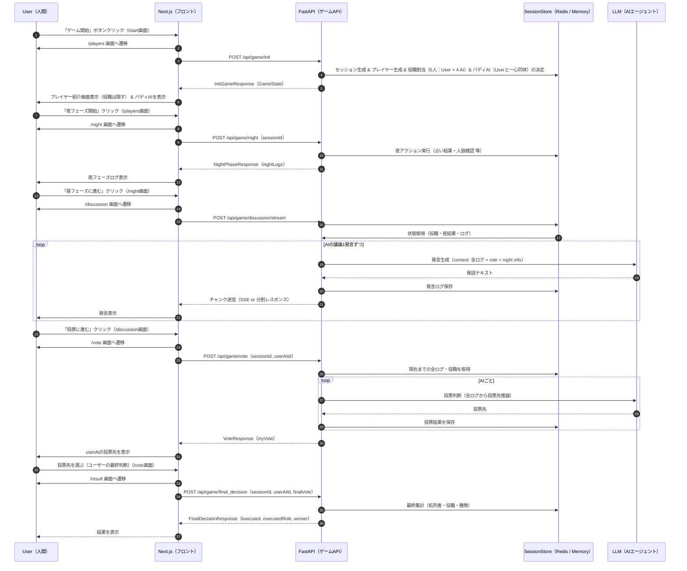

# Init Game Sequence

```mermaid
sequenceDiagram
    autonumber

    participant U as User（人間）
    participant N as Next.js（フロント）
    participant A as FastAPI（ゲームAPI）
    participant S as SessionStore（Redis / Memory）
    participant L as LLM（AIエージェント）

    %% --- Phase 1: Init Game ---
    U->>N: 「ゲーム開始」ボタンクリック（/start画面）
    N->>U: /players 画面へ遷移
    N->>A: POST /api/game/init
    A->>S: セッション生成 & プレイヤー生成 & 役職割当（5人：User + 4 AI）& バディAI（Userと一心同体）の決定
    A-->>N: InitGameResponse（GameState）
    N->>U: プレイヤー紹介画面表示（役職は隠す） & バディAIを表示

    %% --- Phase 2: Night Phase ---
    U->>N: 「夜フェーズ開始」クリック（/players画面）
    N->>U: /night 画面へ遷移
    N->>A: POST /api/game/night（sessionId）
    A->>S: 夜アクション実行（占い結果・人狼確認 等）
    A-->>N: NightPhaseResponse（nightLogs）
    N->>U: 夜フェーズログ表示

    %% --- Phase 3: Discussion Stream ---
    U->>N: 「昼フェーズに進む」クリック（/night画面）
    N->>U: /discussion 画面へ遷移
    N->>A: POST /api/game/discussion/stream
    A->>S:
    S->>A: 状態取得（役職・夜結果・ログ）

    loop AIの議論1発言ずつ
        A->>L: 発言生成（context: 全ログ + role + night info）
        L-->>A: 発話テキスト
        A->>S: 発言ログ保存
        A-->>N: チャンク送信（SSE or 分割レスポンス）
        N->>U: 発言表示
    end

    %% --- Phase 4: Vote Phase (User AI の投票も返す) ---
    U->>N: 「投票に進む」クリック（/discussion画面）
    N->>U: /vote 画面へ遷移
    N->>A: POST /api/game/vote（sessionId, userAiId）
    A->>S: 現在までの全ログ・役職を取得

    %% --- 内部で全AIが投票 ---
    loop AIごと
        A->>L: 投票判断（全ログから投票先推論）
        L-->>A: 投票先
        A->>S: 投票結果を保存
    end

    %% --- UIに返すのは userAi の投票のみ ---
    A-->>N: VoteResponse（myVote）
    N->>U: userAiの投票先を表示

    %% --- Phase 5: Final Decision (最終決断) ---
    U->>N: 投票先を選ぶ（ユーザーの最終判断）（/vote画面）
    N->>U: /result 画面へ遷移
    N->>A: POST /api/game/final_decision（sessionId, userAiId, finalVote）
    A->>S: 最終集計（処刑者・役職・勝敗）
    A-->>N: FinalDecisionResponse（executed, executedRole, winner）

    N-->>U: 結果を表示

```
