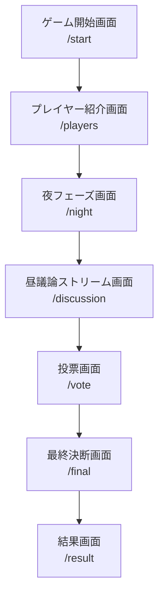

# playground

```mermaid
flowchart TD

    A[ゲーム開始画面<br>/start] --> B[プレイヤー紹介画面<br>/players]
    B --> C[夜フェーズ画面<br>/night]
    C --> D[昼議論ストリーム画面<br>/discussion]
    D --> E[投票画面<br>/vote]
    E --> F[最終決断画面<br>/final]
    F --> G[結果画面<br>/result]
```
