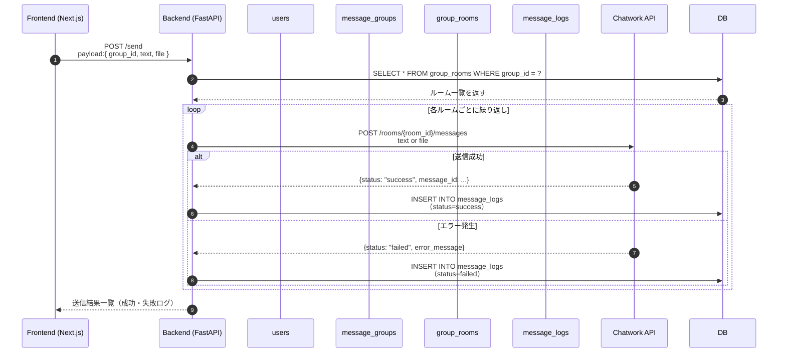

```mermaid
sequenceDiagram
    autonumber
    participant FE as Frontend (Next.js)
    participant BE as Backend (FastAPI)
    participant T_users as users
    participant T_groups as message_groups
    participant T_groupRooms as group_rooms
    participant T_logs as message_logs
    participant CW as Chatwork API
    participant CW as Chatwork API

    %% -----------------------------------------------------------
    %% 1. フロントから送信リクエスト
    %% -----------------------------------------------------------
    FE->>BE: POST /send<br/>payload:{ group_id, text, file }

    %% -----------------------------------------------------------
    %% 2. グループに紐づくルーム一覧を取得
    %% -----------------------------------------------------------
    BE->>DB: SELECT * FROM group_rooms WHERE group_id = ?
    DB-->>BE: ルーム一覧を返す

    loop 各ルームごとに繰り返し
        %% -----------------------------------------------------------
        %% 3. Chatwork API へ送信
        %% -----------------------------------------------------------
        BE->>CW: POST /rooms/{room_id}/messages<br/>text or file
        alt 送信成功
            CW-->>BE: {status: "success", message_id: ...}
            BE->>DB: INSERT INTO message_logs<br/>（status=success）
        else エラー発生
            CW-->>BE: {status: "failed", error_message}
            BE->>DB: INSERT INTO message_logs<br/>（status=failed）
        end
    end

    %% -----------------------------------------------------------
    %% 4. 送信結果をまとめて返却
    %% -----------------------------------------------------------
    BE-->>FE: 送信結果一覧（成功・失敗ログ）

```
